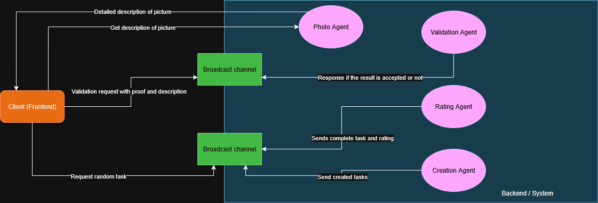
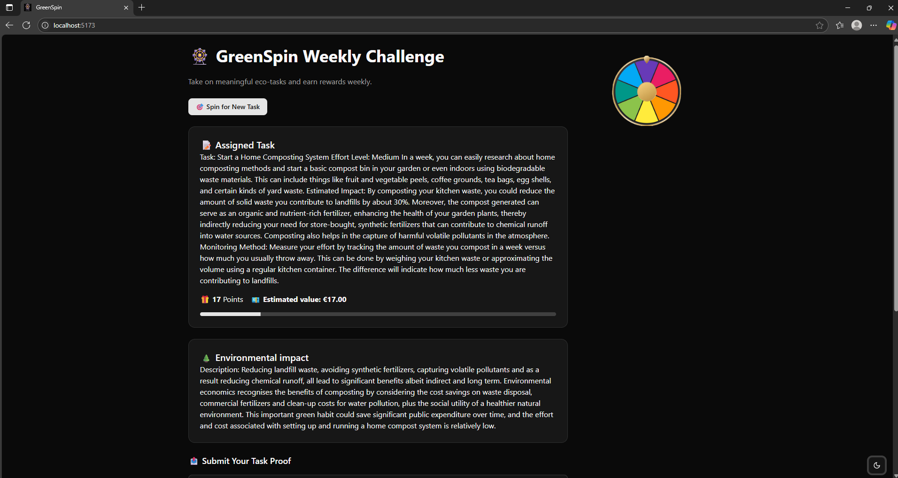
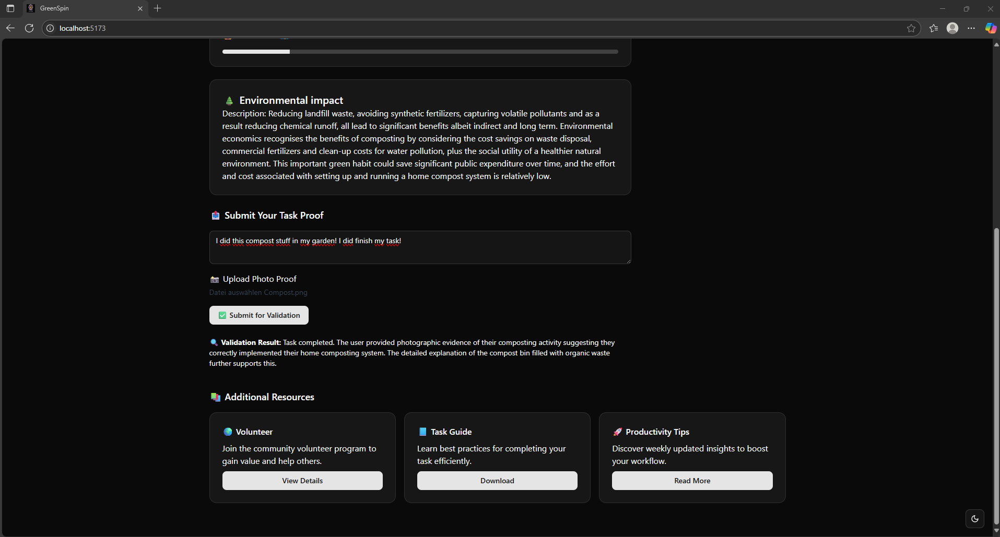

#  GreenSpin - CSR project with AI agent backend

**GreenSpin** is a gamified task platform where employees can voluntarily take on small social and ecological challenges once a week. Participants are rewarded with bonus points that can be exchanged for vouchers or donated to good causes.  
This repository provides an **AI agent backend** powered by [AutoGen](https://github.com/microsoft/autogen) that:

-  **Creates meaningful environmental tasks**
-  **Estimates the value of completed tasks in euros**
-  **Validates user-submitted proof for finished tasks**

---

##  Agent Architecture
.png)

The system is made up of **four intelligent agents**:

1. **TaskCreatorAgent**  
   Creates new environmental or social tasks that are actionable and impactful.

2. **TaskRaterAgent**  
   Assigns a value in euros to the task based on its ecological/social impact and describes the rationale.

3. **ValidationAgent**  
   Validates user-submitted evidence (descriptions and photos) to check whether the task is properly completed.

4. **PhotoAgent** (Only on the final architecture)\
   Provides detailed description from given pictures an is essential for the validation process within the application.

Architecture if we focus on the communication via group chat:
.drawio.png)

Final architecture of this project and current version on main branch:


---

##  Technologies Used

- [AutoGen by Microsoft](https://github.com/microsoft/autogen)
- OpenAI GPT-4 (or compatible LLMs)
- Python 3.8+

---

##  Getting Started

### 1. Clone the Repo

```bash
git https://github.com/ayd858/GreenSpin.git
cd GreenSpin
```
### 2. Install Dependencies

```bash
pip install -r requirements.txt
```
Make sure you have AutoGen installed:

```bash
pip install autogen
```

### 3. Set OpenAI API Key

Set your API key in the environment:
```bash
export OPENAI_API_KEY=your_api_key_here
```
For Windows:
```bash
$env:OPENAI_API_KEY='your_api_key_here'
```

## Project goals
- Encourage weekly employee participation in social/environmental actions
- Provide a transparent reward system based on effort and impact
- Validate contributions to maintain program integrity

## How to run GreenSpin on your own device

### Start FastAPI backend
- Make sure that you have installed all the dependencies regarding FastAPI
- Have a quick look at the requirements.txt in the project
- If you need further help have a look at the FastAPI documentation: https://fastapi.tiangolo.com/tutorial/
- Switch to directory src
- Use the command `uvicorn backend.main:app --reload`

### Start the react vite frontend
- Make sure to install all the dependencies and have a quick look at the requirements.txt
- Create a vite project with shadcn: https://ui.shadcn.com/docs/installation/vite
- Run frontend with `npm install` and `npm run dev`
- Make sure Node JS is installed on your device

## Demo / Pictures of the frontend


